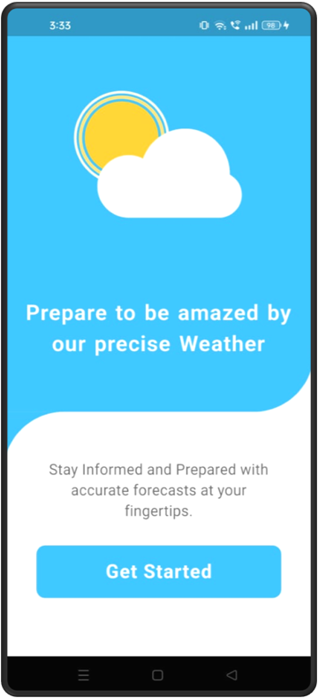
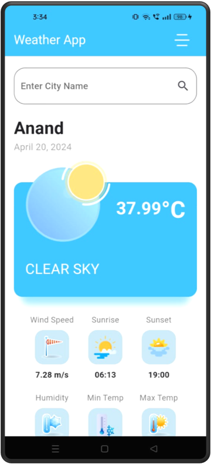
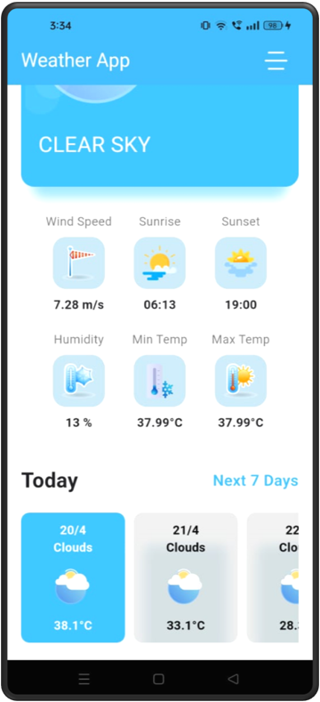
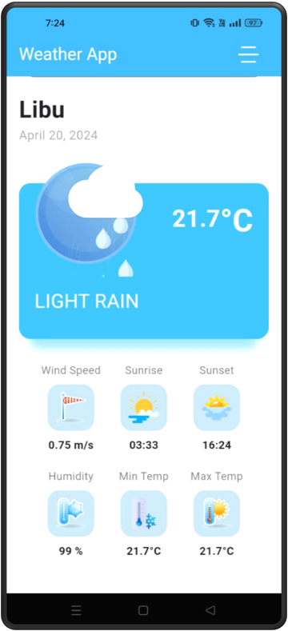
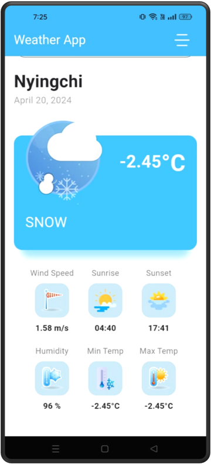

# Flutter Weather Forcasting Application

  * This application displays the current weather forecast for your device current location, and display location and all relevant information.
  * This application allows users to input their city and displays the current weather conditions for that city.
  * [Presentation](https://docs.google.com/presentation/d/1_1-G2Mqy-H0pORFcg3VFQWhrVnyeGH01QFBZZqM4yC8/edit?usp=sharing)
  * [Apk File](https://drive.google.com/file/d/1oVmtHDkwGu1V7ui_tH1CpQBd7b7cxQHW/view?usp=sharing)

## Features

- **User Interface (UI)**:
  * A clean and intuitive UI that includes an input field for city names and an area to display the weather information.
- **User Input**:
  * Users can enter their city name and see the weather details.
- **Location Access**:
  * Displays the current weather forecast for the device's current location.
- **API interaction**:
  * It uses openweathermap Weather API to fetch the current weather details of the city provided by the user.
- **Display Data**:
  * After receiving data from the API, It display the weather information on the screen.
  * This information is comprehensive and including temperature, humidity, wind speed, weather info as well as icons of weather.
- **Conditional Rendering**:
  * It displays a loading indicator to the user while the network request is being processed.
- **Data Persistence**:
  * It saves the last searched city name in the local storage of the device and display its weather information when the app is relaunched using SharedPreferances.
  * Saves the response data for offline use and displays it on application startup or in case of no internet connection.

## App Video

https://github.com/DhavalChhaylaOfficial/Flutter-WeatherApp/assets/82968230/413aecb8-8ff1-430e-acba-40a345a7cb67 
   
## App Snapshots

<table>
  <tr>
    <td>Login Screen</td>
     <td>Login Alert</td>
     <td>Home Screen</td>
  </tr>
  <tr>
    <td></td>
    <td></td>
    <td></td>
  </tr>

   <tr>
    <td>Home Screen</td>
     <td>Product Added</td>
     <td>Cart Screen</td>
  </tr>
  <tr>
    <td></td>
    <td></td>
    <td></td>
  </tr>

 
 </table>

## Build/Run Instructions

1. **Clone this repository to your local machine:**

    ```
    git clone https://github.com/yourusername/your-repo.git
    ```

2. **Navigate to the project directory:**

    ```
    cd your-repo
    ```

3. **Install dependencies:**

    ```
    flutter pub get
    ```

4. **Run the app:**

    ```
    flutter run
    ```

## Dependencies

- [http](https://pub.dev/packages/http) (^1.2.1): A package for making HTTP requests.
- [shared_preferences](https://pub.dev/packages/shared_preferences) (^2.2.1): A package for persistent storage using shared preferences on Android and NSUserDefaults on iOS.
- [geolocator](https://pub.dev/packages/geolocator) (^11.0.0): A Flutter geolocation plugin which provides easy access to platform-specific location services.
- [geocoding](https://pub.dev/packages/geocoding) (^3.0.0): A Flutter plugin for forward and reverse geocoding.
- [intl](https://pub.dev/packages/intl) (^0.19.0): A package containing date and number formatting utilities.
- [lottie](https://pub.dev/packages/lottie) (^3.1.0): A Flutter package for rendering Adobe After Effects animations natively.
- [animated_splash_screen](https://pub.dev/packages/animated_splash_screen) (^1.3.0): A package for creating beautiful animated splash screens in Flutter.
- [url_launcher](https://pub.dev/packages/url_launcher) (^6.2.5): A Flutter plugin for launching a URL in the mobile platform.
- [flutter_social_button](https://pub.dev/packages/flutter_social_button) (^1.1.4+1): A package containing social login buttons for Flutter apps.
- [font_awesome_flutter](https://pub.dev/packages/font_awesome_flutter) (^10.7.0): The Font Awesome Icon pack available as Flutter Icons.
- [share](https://pub.dev/packages/share) (^2.0.4): A Flutter plugin for sharing content via the platform's share dialog.


## Contributing Guidelines

- Report any issues using the GitHub issue tracker.
- Feel free to fork the repository and submit pull requests for new features or bug fixes.

## License

This project is licensed under the MIT License - see the [LICENSE.md](LICENSE.md) file for details.

## Contact

For questions or feedback, contact Dhaval Chhayla at dhavalhchhayla@gmail.com.

 
